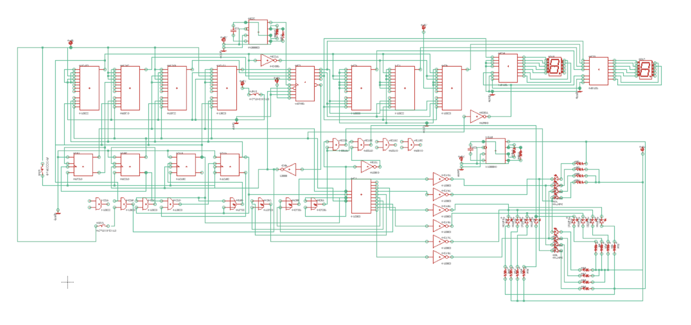
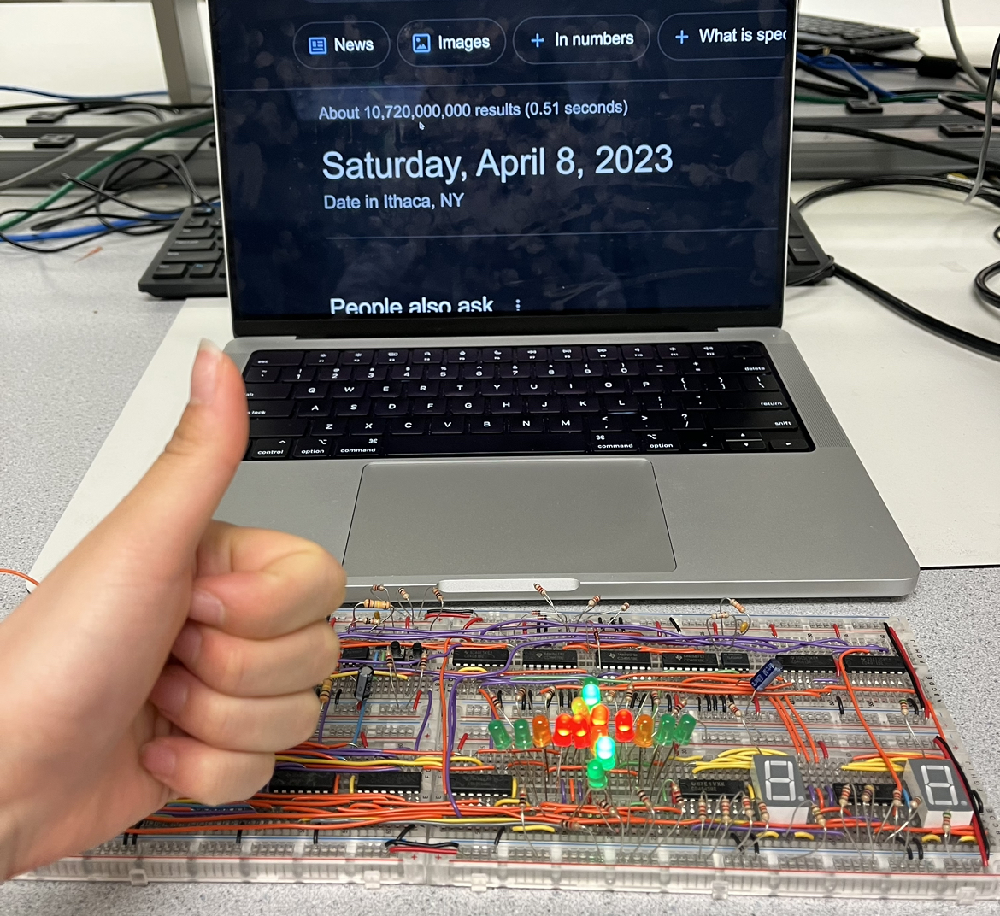

# 60-Second Traffic Light with Override Button
### Digital Logic Design Project

<!--  -->

    

The project involved creating a traffic light system that allows both drivers and pedestrians to cross the intersection by looking at the LED lights and 7 segment displays. Inventory is limited to one counter and a maximum of 4 breadboards. The project used 2 momentary switches for resetting the system and overriding that allows the people to wait less time by shortening the time remaining for the green light in traffic into 6 seconds if the button is pressed. In the project, 16 emitting diodes show the traffic light pattern in the intersection of the roads and two 7-segment displays show the time left for pedestrians to cross, from 12 to 0 second.

### Circuit Design Justification

As shown below, the circuit was designed based on specific traffic patterns, durations, and orientation. The circuit includes four traffic lights with green, yellow, red and green turn signals, and pedestrian sign which shows the last 12 seconds by counting down from 12 to 0.

<!--  -->

    

Given the sequence and duration of lights specified, a presettable CMOS Up/Down Counter (CD4029) is used with four multiplexors (MUXs) and a state counter. Given BINARY/DECADE is high and UP/DOWN is low, the counter counts down from the number of jam input to zero with a frequency from a connected timer. The counter receives jam input values from the four MUXs. Whenever it reaches 0 seconds, CD4029 changes the CARRY-OUT* (Cout) pin to 1 to 0. With this change in value, Cout is connected to a Modulo-5 (MOD-5) Synchronous counter which controls MUXs. 

Given the specific durations, 4 MUXs are made to give jam inputs in the down counter (CD4029). To set up input values for each MUX, the table is divided into two cycles based on the pattern of the following:

<!--  -->

    

The variable E represents the cycle. E = 0 means the first cycle, and E = 1 shows the second cycle. Moreover, the duration of the green signal is divided into two states, 13 and 6 seconds for the first cycle, and 15 and 5 seconds for second, in order to represent time in 4 bits and make it able to override by skipping the state. Whenever the override button is pressed, if it’s third state or the leftmost bit of t in binary is 1, it skips to the next state and gives input of 6 seconds to the 4029 counter.

To repeat 5 patterns of lights, the MOD-5 counter is created by using three D-type flip flops (CD4013) which give output as Qa, Qb, and Qc. MOD-5 counter provides binary outputs from 000 to 100 and repeats as a loop. This binary output allows 4 MUXs to change a state by controlling inputs of each multiplexer. The logic for creating the MOD-5 counter includes 2 AND gates and 1 XOR gate.

For controlling the number of cycles, another D Flip Flop is used. It functions to store the value and changes the variable E whenever MOD-5 repeats or after MOD-5 is equal to 100 (QcQbQa). Therefore, the clock pin of the flip flop is connected to Qc* from the MOD-5. Q pin of the flip flop is connected to the E input pins of MUXs, and the Q* pin is connected to E*.

For setting an initial condition and an override, set and reset values of D Flip Flops are reset. Two momentary buttons are used for each function. Set pins of D Flip Flops are grounded and reset pins are connected to the buttons. The button is connected to the power and other sides are connected to the ground to avoid a short circuit. When the button is pressed, the button sends a high voltage to reset the pin in order to preset the D value in the flip flop to zero. 

By dividing the duration of green light into two, its binary number should be transformed in order to display from 12 to 0. The last 6 seconds of the third state, the first part of green light, should be changed to the numbers 12 to 7, while the second part of green light should not be transformed. This transformation is held by adding 3 MUXs. By comparing the binary numbers from 6 to 1(QdQcQbQa) and 12 to 7 (DdDcDbDa), it is noticeable that the rightmost bits of both numbers are the same (Qa = Da). For other bits, three MUXs are used with a function of D as an input. The variable D is an output from the D MUX. D = 1 means the third state which is overridable. This allows creating a function of D as input. When D = 0, the output of the MUXs should be QdQcQbQa. When D = 1, the output should be DdDcDbDa.

These outputs are connected to the decoder for a 7-segment display (CD4543) with a common cathode to show pedestrian lights.
Additionally, the CD4028 decoder is added to control the LEDs. 

    

### Schematics
Based on the design, the schematics are created. It includes the MOD-5 counter with D flip flops, AND gates, XOR gates, MUXs, and the decoder for a 7-segment display (CD4543) with a common cathode to show pedestrian lights.

    

### Timing

The circuit includes two timers: 1 Hz and 2 Hz. 1Hz timer is connected to the CD4029 counter to count down in exact seconds, and 2 Hz timer is connected to the Green Arrow LEDs. To build these timers, a 4.7 µF capacitor, a 10 KΩ resistor R1, and a 150 KΩ resistor for R2 are used for 1 Hz of frequency, and a 10 µF capacitor, a 6.8 KΩ resistor for R1, and a 33 KΩ resistor for R2 are used for 2 Hz of frequency.

### Demo Videos

[Traffic Light System with Override](https://photos.app.goo.gl/o4Ym9V5aBbDKFEjX7)

[60-second Traffic Light - without Override](https://photos.app.goo.gl/65oabXMogcXNZXeMA)

### Is it still working?

Yes!

    

