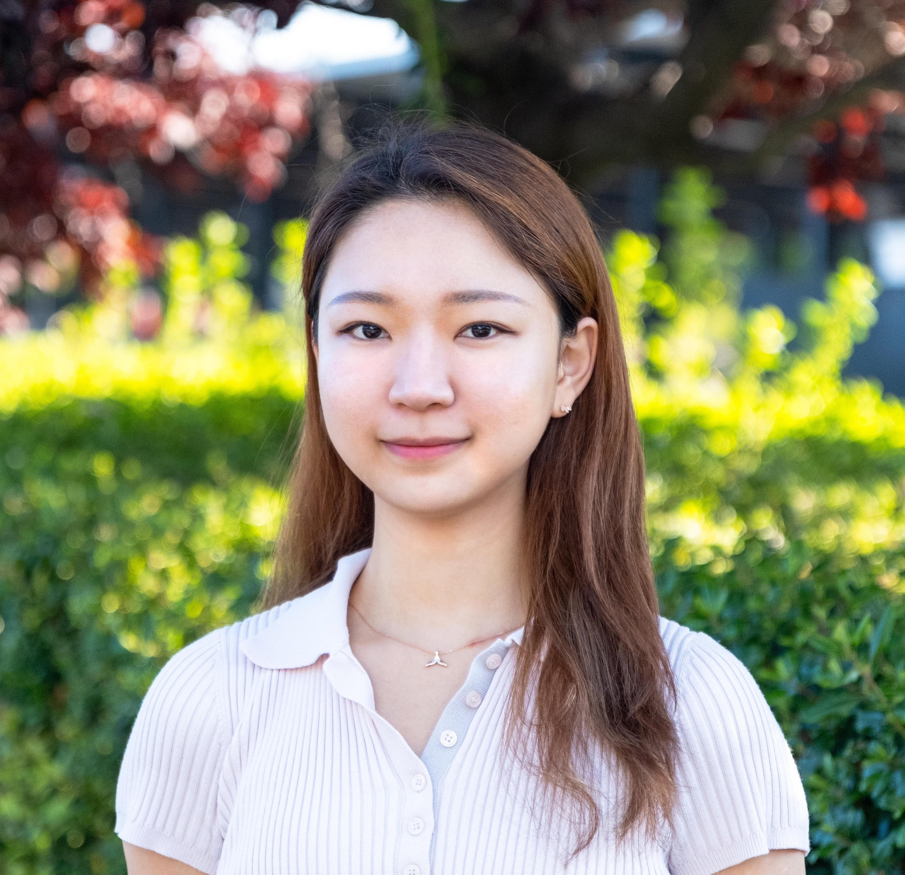

## Hello

    

My name is Minjung, and I am a Master of Engineering student studying Electrical and Computer Engineering (ECE) at Cornell University. I graduated with a Bachelor's degree in ECE and a Computer Science minor at Cornell in May 2023. 
As an Early M.Eng. program student, I will be graduating in December 2023 with a Master's degree in ECE.
 
My interests lie in embedded/firmware or low-level software. I'm actively looking for a full-time job after graduation in December 2023.

## More about me

I am currently working as a Graduate Teaching Assistant in a Master-level course, called Design with Embedded Operating Systems ([ECE5725](https://skovira.ece.cornell.edu/ece5725/)).
With schoolwork, I work as a Systems Validation Engineering Intern at Intel Programmable Solutions Group (PSG). 
 
Also, I am part of the E-Board at [Cornell Maker Club](https://makerclub.ece.cornell.edu). This year, we organized the 2023 Make-A-Thon.

### More More about me
Download my resume to learn more about me.
<a href="https://minjk121.github.io/about/Resume_09.22.23.docx" target="Download Resume" />
Thank you for visiting my website!

## Contact me

[Email](mailto:mk2592@cornell.edu)  
[LinkedIn](https://www.linkedin.com/in/minjung-kwon/)

    
    

