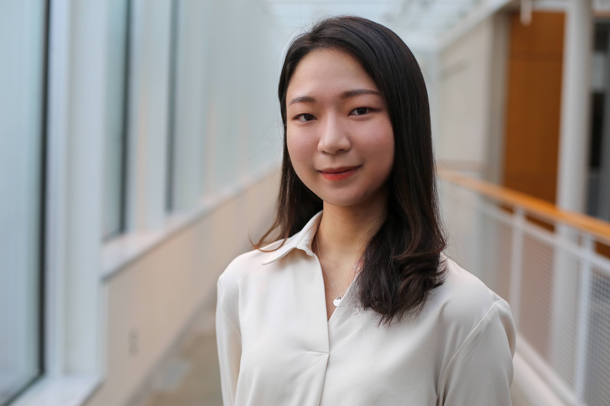

## Hello

    

My name is Minjung, and I am a senior and M.Eng. student studying Electrical and Comptuer Engineering at [Cornell University](https://www.cornell.edu/). I am minoring in Computer Science and in Early ECE M.Eng. Program. 

I worked at Apple as a SWE intern in 2022, and I'm currently seeking for 2023 internship!

## Contact me

[Email](mk2592@cornell.edu)
[LinkedIn](https://www.linkedin.com/in/minjung-kwon/)

## More About me

I am currently TAing [ECE5725](https://skovira.ece.cornell.edu/ece5725/) and working as a [peer advisor](https://www.engineering.cornell.edu/students/undergraduate-students/advising/peer-advisors/meet-peer-advisors) @ CornellEng and as a library assistant @ Uris & Olin library. 

Also, check out the [Cornell Maker Club](https://makerclub.ece.cornell.edu). This year, we organized the 2023 Make-A-Thon!
    
    

